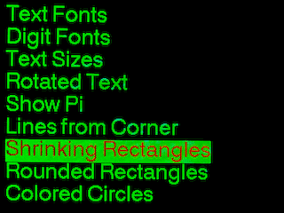
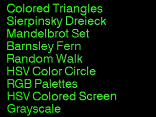
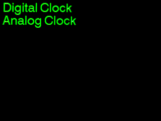
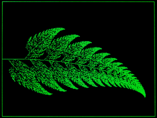
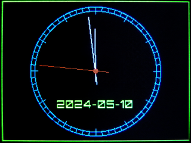
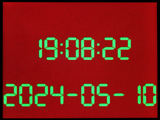

# CYD Multi-Page Touch Menu with the ESP32-2432S028R (Cheap Yellow Display)
This example program shows how to implement a multi-page touch menu for calling 
up various actions. A clicked menu item is selected and highlighted. Another 
click on the selected menu item executes the assigned action. Further menu 
items are displayed by swiping (up or down).

To control the menu, a touch handler is implemented that can 
distinguish between the events **click**, **longclick** and **swipe** in the 
four directions **up**, **down**, **left** and **right**.
The user-defined callbacks **onShortClick**, **onLongClick**, **onSwipeUp**, 
**onSwipeDown**, **onSwipeLeft** and **onSwipeRight** are installed for this 
purpose. The program retrieves the time from an NTP server and therefore 
requires a WiFi connection. The SSID and password of the router must therefore 
be entered in the initWiFi.cpp file.

The screenshots show the 3 menu pages of the sample program and the result
pages of 3 called actions.

|                               |                                |
|:-----------------------------:|:------------------------------:|
|  |   |
|  ||
|||

